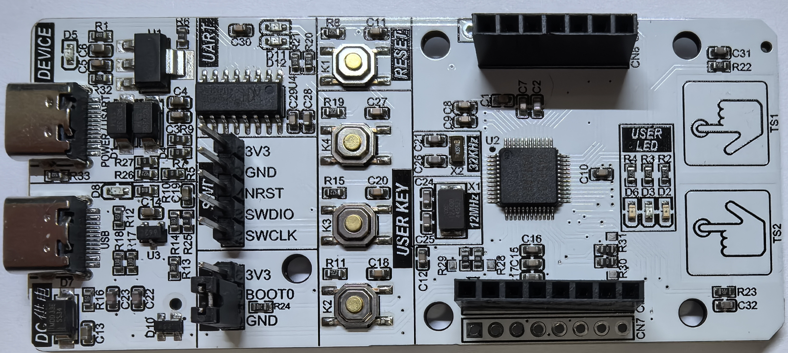
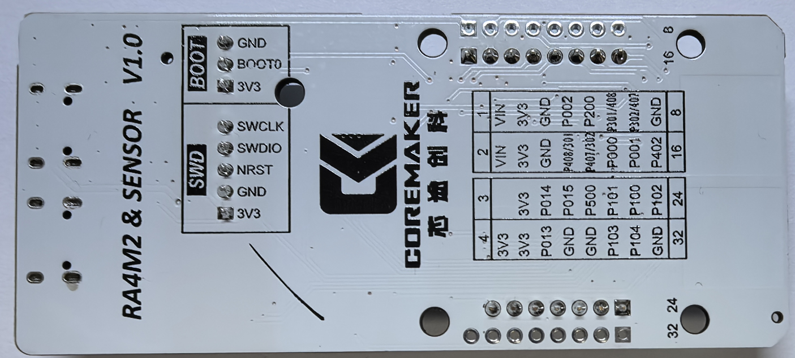
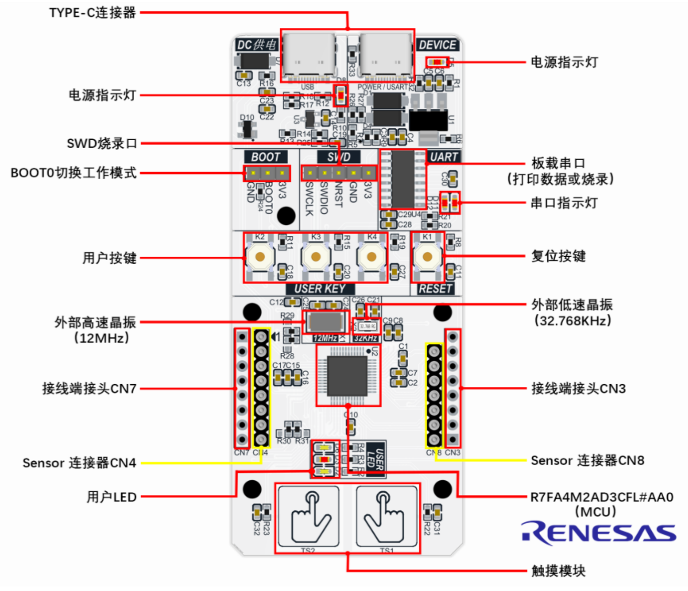
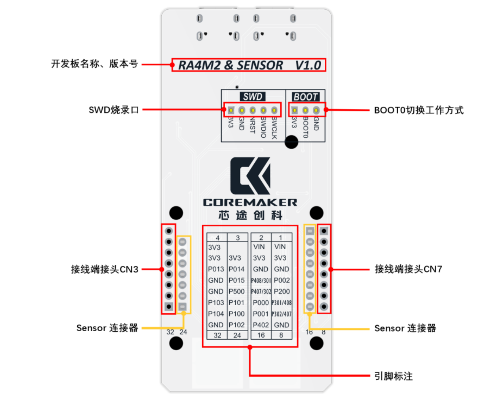
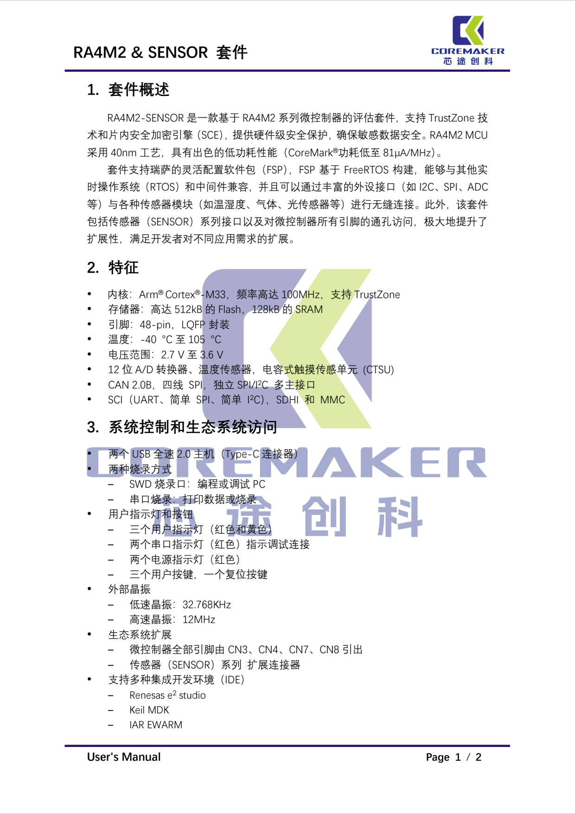
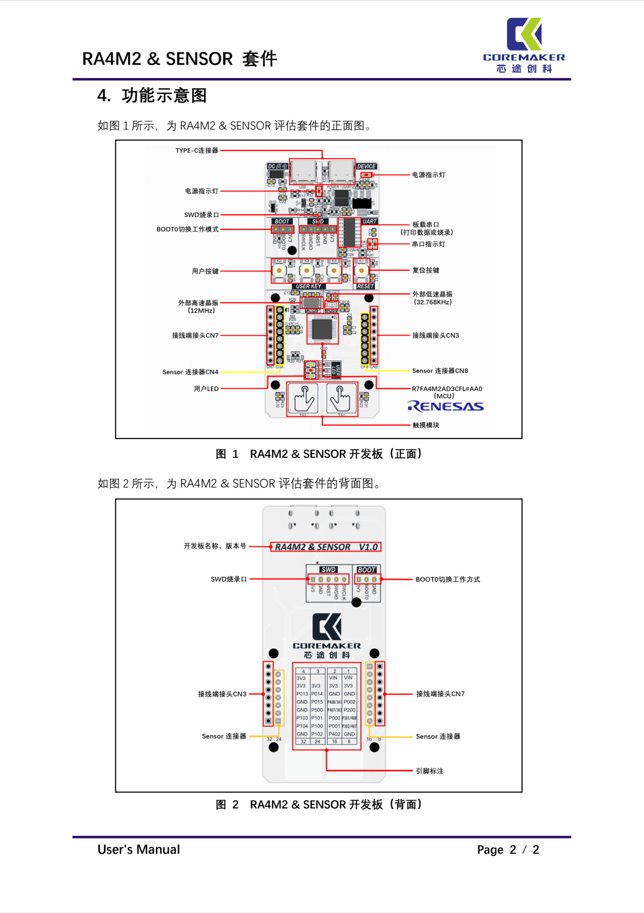

# Overview
- **Name**: RA4M2_SENSOR-V1.0
- **MCU**: R7FA4M2AD3CFL#AA0
- **IDE**: E2STUDIO

  

# Contact Information

- **Name**: Billy
- **交流群**: 925643491
- **Email**: a845656974@outlook.com
- **Phone**: +86 15622736378
- **CSDN Blog**: [Blog](https://blog.csdn.net/xinzuofang)
- **Video**: [Video](https://space.bilibili.com/3546563710290070)

# Buy Link
[https://shop192352884.taobao.com/](https://shop192352884.taobao.com/)

 
# Image

# Project Introduction
- **RA4M2_project1**:e2studio开发RA4M2(1)---开发板测试
- **CSDN Blog**:[https://coremaker.blog.csdn.net/article/details/144953922](https://coremaker.blog.csdn.net/article/details/144953922)
- **Video**:[https://www.bilibili.com/video/BV1E3CrYfEpf/](https://www.bilibili.com/video/BV1E3CrYfEpf/)

RA4M2 评估套件可以使用户能够无缝评估 RA4M2 系列LQFP48 封装的微控制器功能，基于 ARM Cortex-M33 内核，具有高效能和低功耗的特点。它适用于各种嵌入式系统，特别是对功耗和成本有较高要求的应用。

这里通过配置LED和UART输出进行简单测试。

The RA4M2 evaluation kit enables users to seamlessly evaluate the functionality of the RA4M2 series microcontroller in an LQFP48 package, based on the ARM Cortex-M33 core, offering high performance and low power consumption. It is suitable for various embedded systems, especially applications with high demands for power efficiency and cost-effectiveness.

A simple test is conducted here by configuring LED and UART output.

- **RA4M2_project2**:e2studio开发RA4M2(2)---Programmer烧录程序
- **CSDN Blog**:[https://coremaker.blog.csdn.net/article/details/144953944](https://coremaker.blog.csdn.net/article/details/144953944)
- **Video**:[https://www.bilibili.com/video/BV1tQC6YkEBn/](https://www.bilibili.com/video/BV1tQC6YkEBn/)

Renesas Flash Programmer是一款支持开发和批量生产阶段写入的软件，具有简单的 GUI，即使是初学者也能简单操作进行写入。
运行环境支持Windows、Linux、macOS。
这里使用Renesas Flash Programmer软件进行下载。

Renesas Flash Programmer is a software tool that supports programming during both the development and mass production stages, featuring a simple GUI that even beginners can easily use for programming.
It supports operating environments including Windows, Linux, and macOS.
Here, we use Renesas Flash Programmer software for downloading.

- **RA4M2_project3**:e2studio开发RA4M2(3)----使用J-Link或EZ-CUBE3烧录程序
- **CSDN Blog**:[https://coremaker.blog.csdn.net/article/details/145425307](https://coremaker.blog.csdn.net/article/details/145425307)
- **Video**:[https://www.bilibili.com/video/BV1maFyefEZ1/](https://www.bilibili.com/video/BV1maFyefEZ1/)

这一节主要讲解如何使用J-Link或EZ-CUBE3对瑞萨RA芯片进行烧录。

This section primarily explains how to use J-Link or EZ-CUBE3 to program Renesas RA chips.

- **RA4M2_project4**:e2studio开发RA4M2(4)----GPIO输出
- **CSDN Blog**:[https://coremaker.blog.csdn.net/article/details/145430716](https://coremaker.blog.csdn.net/article/details/145430716)
- **Video**:[https://www.bilibili.com/video/BV1SoPQe8EnU/](https://www.bilibili.com/video/BV1SoPQe8EnU/)

本篇文章主要介绍如何使用e2studio对瑞萨单片机进行GPIO输出，并以LED显示。

This article primarily explains how to use e2studio to perform GPIO output on Renesas microcontrollers, with an LED display as an example.

- **RA4M2_project5**:e2studio开发RA4M2(5)----GPIO输入检测
- **CSDN Blog**:[https://coremaker.blog.csdn.net/article/details/145431909](https://coremaker.blog.csdn.net/article/details/145431909)
- **Video**:[https://www.bilibili.com/video/BV1BpPRenESJ/](https://www.bilibili.com/video/BV1BpPRenESJ/)

本篇文章主要介绍如何使用e2studio对瑞萨单片机进行GPIO输入检测。

This article primarily explains how to use e2studio to perform GPIO input detection on Renesas microcontrollers.

- **RA4M2_project6**:e2studio开发RA4M2(6)----GPIO外部中断（IRQ）配置
- **CSDN Blog**:[https://coremaker.blog.csdn.net/article/details/145446522](https://coremaker.blog.csdn.net/article/details/145446522)
- **Video**:[https://www.bilibili.com/video/BV1dANAeKEjm/](https://www.bilibili.com/video/BV1dANAeKEjm/)

GPIO（通用输入/输出）引脚作为嵌入式系统的基本接口，可以用于信号输入、输出以及事件检测。GPIO外部中断（IRQ）是一种常见的硬件中断配置，通过在特定引脚上检测信号的变化（例如上升沿或下降沿）来触发中断响应。这种机制在按钮按压、传感器信号输入等场景中尤为常用，可实现低延迟的事件捕获与处理。

GPIO (General Purpose Input/Output) pins serve as fundamental interfaces in embedded systems, allowing for signal input, output, and event detection. GPIO external interrupts (IRQ) are a common hardware interrupt configuration that triggers an interrupt response by detecting changes in signal states (such as rising or falling edges) on specific pins. This mechanism is particularly useful in scenarios like button presses or sensor signal inputs, enabling low-latency event capture and processing.

- **RA4M2_project7**:e2studio开发RA4M2(7)----定时器GPT输出PWM
- **CSDN Blog**:[https://coremaker.blog.csdn.net/article/details/145479954](https://coremaker.blog.csdn.net/article/details/145479954)
- **Video**:[https://www.bilibili.com/video/BV1BVNpecEzj/](https://www.bilibili.com/video/BV1BVNpecEzj/)

GPT（通用 PWM 计时器）模块是一个高精度定时器，用于计数事件、测量外部输入信号、生成周期性中断，或输出周期性信号/PWM 信号到 GTIOC 引脚。它广泛应用于定时控制、信号测量、PWM 生成等应用，尤其适用于电机控制、LED 调光、PWM 伺服驱动和 ADC 触发等场景。

The GPT (General Purpose PWM Timer) module is a high-precision timer used for counting events, measuring external input signals, generating periodic interrupts, or outputting periodic signals/PWM signals to the GTIOC pins. It is widely used in applications such as timing control, signal measurement, and PWM generation, and is particularly suitable for scenarios like motor control, LED dimming, PWM servo driving, and ADC triggering.

- **RA4M2_project8**:e2studio开发RA4M2(8)----GPT定时器频率与占空比的设置
- **CSDN Blog**:[https://coremaker.blog.csdn.net/article/details/145481618](https://coremaker.blog.csdn.net/article/details/145481618)
- **Video**:[https://www.bilibili.com/video/BV1RzNHeWEDs/](https://www.bilibili.com/video/BV1RzNHeWEDs/)

GPT（通用 PWM 计时器）模块是一个高精度定时器，用于计数事件、测量外部输入信号、生成周期性中断，或输出周期性信号/PWM 信号到 GTIOC 引脚。它广泛应用于定时控制、信号测量、PWM 生成等应用，尤其适用于电机控制、LED 调光、PWM 伺服驱动和 ADC 触发等场景。
本文将详细介绍如何上一章基础上通过GPT定时器的API调整频率和占空比，并解释相关的关键概念和设置方法。

The GPT (General Purpose PWM Timer) module is a high-precision timer used for counting events, measuring external input signals, generating periodic interrupts, or outputting periodic signals/PWM signals to the GTIOC pins. It is widely used in applications such as timing control, signal measurement, and PWM generation, and is particularly suited for scenarios like motor control, LED dimming, PWM servo driving, and ADC triggering.

This article will provide a detailed explanation of how to adjust the frequency and duty cycle using the GPT timer's API, building on the previous chapter, and will explain the key concepts and configuration methods involved.

- **RA4M2_project9**:e2studio开发RA4M2(9)----定时器GPT配置输入捕获
- **CSDN Blog**:[https://coremaker.blog.csdn.net/article/details/145522583](https://coremaker.blog.csdn.net/article/details/145522583)
- **Video**:[https://www.bilibili.com/video/BV1uiNVesE8K/](https://www.bilibili.com/video/BV1uiNVesE8K/)

本文将探讨如何在 Renesas RA 系列微控制器上使用 GPT（通用定时器）模块来配置输入捕获功能。输入捕获是定时器的一项重要功能，它允许我们捕获外部信号（如脉冲或波形）的时间戳，广泛应用于频率计数、脉冲宽度测量以及其他需要精确时间记录的应用。

This article explores how to use the GPT (General-Purpose Timer) module on Renesas RA series microcontrollers to configure the input capture function.

Input capture is a key timer feature that allows capturing timestamps of external signals (such as pulses or waveforms). It is widely used in frequency measurement, pulse width measurement, and other applications requiring precise time recording.

- **RA4M2_project10**:e2studio开发RA4M2(10)----定时器AGT输出PWM
- **CSDN Blog**:[https://coremaker.blog.csdn.net/article/details/145534206](https://coremaker.blog.csdn.net/article/details/145534206)
- **Video**:[https://www.bilibili.com/video/BV1EjNmeKEmL/](https://www.bilibili.com/video/BV1EjNmeKEmL/)

AGT模块是RA MCU（微控制单元）系列中的一个定时器外设，提供灵活的计时和事件捕获功能，能够满足多种应用场景中的定时和控制需求。它支持16位和32位定时器，并具有多种工作模式，适用于需要高精度时间控制和事件捕获的应用。 它广泛应用于定时控制、信号测量、PWM 生成等应用，尤其适用于电机控制、LED 调光、PWM 伺服驱动和 ADC 触发等场景。

The AGT module is a timer peripheral in the RA MCU (Microcontroller Unit) series, providing flexible timing and event capture capabilities to meet the timing and control requirements of various applications.

It supports both 16-bit and 32-bit timers and offers multiple operating modes, making it suitable for applications that require high-precision time control and event capture.

The AGT module is widely used in timing control, signal measurement, and PWM generation, particularly in motor control, LED dimming, PWM servo drive, and ADC triggering scenarios.

- **RA4M2_project11**:e2studio开发RA4M2(11)----AGT定时器频率与占空比的设置
- **CSDN Blog**:[https://coremaker.blog.csdn.net/article/details/145534501](https://coremaker.blog.csdn.net/article/details/145534501)
- **Video**:[https://www.bilibili.com/video/BV1jzN2ehEa9/](https://www.bilibili.com/video/BV1jzN2ehEa9/)

AGT模块是一个高精度定时器，用于计数事件、测量外部输入信号、生成周期性中断，或输出周期性信号/PWM 信号到 GTIOC 引脚。它广泛应用于定时控制、信号测量、PWM 生成等应用，尤其适用于电机控制、LED 调光、PWM 伺服驱动和 ADC 触发等场景。
本文将详细介绍如何上一章基础上通过AGT定时器的API调整频率和占空比，并解释相关的关键概念和设置方法。

The AGT module is a high-precision timer used for counting events, measuring external input signals, generating periodic interrupts, or outputting periodic signals/PWM signals to the GTIOC pin. It is widely used in applications such as timing control, signal measurement, and PWM generation, particularly in motor control, LED dimming, PWM servo drive, and ADC triggering scenarios.

This article will provide a detailed explanation of how to adjust the frequency and duty cycle using the AGT timer API based on the previous chapter, along with an explanation of key concepts and configuration methods.

- **RA4M2_project12**:e2studio开发RA4M2(12)----打印函数(printf、 sprintf)的实现
- **CSDN Blog**:[https://coremaker.blog.csdn.net/article/details/145602098](https://coremaker.blog.csdn.net/article/details/145602098)
- **Video**:[https://www.bilibili.com/video/BV1zQK7eXE8H/](https://www.bilibili.com/video/BV1zQK7eXE8H/)

printf 和 sprintf 是 C 语言中常用的输出函数，广泛应用于各种嵌入式、桌面应用程序和调试过程中。这些函数可以将格式化的数据输出到标准输出（如控制台）或存储到字符串中。在系统开发中，了解它们的底层实现不仅能够帮助优化性能，还能提高代码的可移植性和灵活性。

printf and sprintf are commonly used output functions in the C language, widely applied in various embedded systems, desktop applications, and debugging processes. These functions allow formatted data to be output to standard output (such as the console) or stored in a string. In system development, understanding their underlying implementation not only helps optimize performance but also enhances code portability and flexibility.

- **RA4M2_project13**:e2studio开发RA4M2(13)----串口接收数据
- **CSDN Blog**:[https://coremaker.blog.csdn.net/article/details/145602270](https://coremaker.blog.csdn.net/article/details/145602270)
- **Video**:[https://www.bilibili.com/video/BV1UVKEeBEyM/](https://www.bilibili.com/video/BV1UVKEeBEyM/)

串口通信（UART）是一种常用的异步数据传输方式，在嵌入式系统中广泛应用于设备之间的数据交互。本文主要探讨如何通过串口接收数据，包括初始化配置、数据接收流程、常见问题处理以及实现串口数据接收的实际代码示例。本博客旨在帮助开发者快速掌握串口接收的基础知识与技巧，从而在实际项目中灵活应用。

UART (Universal Asynchronous Receiver/Transmitter) communication is a commonly used asynchronous data transmission method, widely applied in embedded systems for data exchange between devices. This article focuses on how to receive data via UART, covering initialization configuration, data reception process, common issue troubleshooting, and practical code examples for implementing UART data reception. The goal of this blog is to help developers quickly grasp the fundamentals and techniques of UART reception, enabling flexible application in real-world projects.

- **RA4M2_project14**:e2studio开发RA4M2(14)----IIC驱动水压计LPS28DFW
- **CSDN Blog**:[https://coremaker.blog.csdn.net/article/details/145957231](https://coremaker.blog.csdn.net/article/details/145957231)
- **Video**:[https://www.bilibili.com/video/BV1JtwZeoEjN/](https://www.bilibili.com/video/BV1JtwZeoEjN/)

本篇文章主要介绍如何使用e2studio对瑞萨进行IIC配置，使用 LPS28DFW 传感器来读取数据，读取到的数据会被转换为适当的单位并通过串行通信输出。

This article mainly introduces how to configure I²C for Renesas using e²studio and how to read data from the LPS28DFW sensor. The acquired data will be converted into appropriate units and output via serial communication.

- **RA4M2_project15**:e2studio开发RA4M2(15)----配置RTC时钟及显示时间
- **CSDN Blog**:[https://coremaker.blog.csdn.net/article/details/146025827](https://coremaker.blog.csdn.net/article/details/146025827)
- **Video**:[https://www.bilibili.com/video/BV1dDXQY5E57/](https://www.bilibili.com/video/BV1dDXQY5E57/)

本文将详细讲解如何借助e2studio来对瑞萨微控制器进行实时时钟（RTC）的设置和配置，以便实现日历功能和一秒钟产生的中断，从而通过串口输出实时数据。
实时时钟（RTC）模块是一种时间管理外设，主要用于记录和控制日期和时间。与常见的微控制器（MCU）中的定时器不同，RTC时钟提供了两种计时方式：日期模式和计时模式。RTC时钟的常用功能包括设置时间、设定闹钟、配置周期性中断以及启动或停止操作。
通过使用e2studio工具，我们可以轻松地对瑞萨微控制器进行RTC配置，从而实现高精度的时间和日期管理。在本文中，我们将重点讨论如何设置RTC时钟日历和产生一秒钟的中断，使得串口能够实时打印数据。

This article provides a detailed explanation of how to configure and set up the Real-Time Clock (RTC) on a Renesas microcontroller using e²studio, enabling calendar functionality and generating one-second interrupts to output real-time data via serial communication.

The RTC module is a time management peripheral primarily used for tracking and controlling date and time. Unlike general-purpose timers in microcontrollers (MCUs), the RTC clock provides two timing modes: date mode and time mode. Common RTC functionalities include setting time, configuring alarms, enabling periodic interrupts, and controlling start/stop operations.

By leveraging e²studio, we can easily configure the RTC on Renesas microcontrollers to achieve high-precision time and date management. In this article, we will focus on setting up the RTC calendar and generating one-second interrupts, allowing real-time data output via serial communication.

- **RA4M2_project16**:e2studio开发RA4M2(16)----ADC单通道采集电压
- **CSDN Blog**:[https://coremaker.blog.csdn.net/article/details/146026355](https://coremaker.blog.csdn.net/article/details/146026355)
- **Video**:[https://www.bilibili.com/video/BV1NnXoY3E5W/](https://www.bilibili.com/video/BV1NnXoY3E5W/)

本篇文章主要介绍如何使用e2studio对瑞萨单片机进行ADC单通道采集电压。

This article focuses on how to use e²studio to configure and perform single-channel ADC voltage acquisition on a Renesas microcontroller.

- **RA4M2_project17**:e2studio开发RA4M2(17)----ADC扫描多通道采样
- **CSDN Blog**:[https://coremaker.blog.csdn.net/article/details/146028188](https://coremaker.blog.csdn.net/article/details/146028188)
- **Video**:[https://www.bilibili.com/video/BV1NnXoY3E5W/](https://www.bilibili.com/video/BV1NnXoY3E5W/)

在嵌入式系统中，ADC（模数转换器）是一个非常重要的组件，它将模拟信号转换为数字信号。为了提高采样效率和扩展应用，瑞萨MCU支持多通道扫描模式，允许同时采集多个模拟信号。在本文中，将在上篇文章基础上探讨如何配置ADC模块进行多通道扫描，并采集来自不同的输入模拟信号。

In embedded systems, the ADC (Analog-to-Digital Converter) is a crucial component that converts analog signals into digital signals. To improve sampling efficiency and expand application scenarios, Renesas MCUs support multi-channel scan mode, allowing simultaneous acquisition of multiple analog signals.

Building on the previous article, this article explores how to configure the ADC module for multi-channel scanning and collect data from different analog input signals.

- **RA4M2_project18**:e2studio开发RA4M2(18)----看门狗WDT
- **CSDN Blog**:[https://coremaker.blog.csdn.net/article/details/146028540](https://coremaker.blog.csdn.net/article/details/146028540)
- **Video**:[https://www.bilibili.com/video/BV1UL9hYrEkV/](https://www.bilibili.com/video/BV1UL9hYrEkV/)

本文主要阐述了如何借助e2studio工具对瑞萨独立看门狗WDT进行配置设置，同时设置RTC时钟产生每秒的周期性中断，并通过串口输出观察独立看门狗IWDT的计数情况。主要介绍 RA 系列 MCU 的看门狗定时器（WDT），包括其功能、配置方法、API 说明及示例代码。看门狗定时器主要用于检测系统异常，防止程序陷入死循环或卡死，从而 提高系统稳定性。
看门狗定时器（WDT）是一种超时保护机制，当 MCU 在一定时间内没有刷新（喂狗）时，WDT 会触发系统 复位 或 中断，确保系统能够恢复运行。

This article explains how to configure and set up the Independent Watchdog Timer (IWDT) on a Renesas MCU using the e²studio tool. It also covers configuring the RTC clock to generate periodic one-second interrupts and observing the IWDT counter through serial output.

The article primarily introduces the Watchdog Timer (WDT) in the RA series MCUs, including its functionality, configuration methods, API usage, and example code. The WDT is designed to detect system anomalies and prevent the program from getting stuck in infinite loops or crashes, thereby improving system stability.

The Watchdog Timer (WDT) is an overflow protection mechanism that triggers a system reset or interrupt when the MCU fails to refresh (feed the watchdog) within a specified time, ensuring the system can recover and continue operation.

- **RA4M2_project19**:e2studio开发RA4M2(19)----独立看门狗IWDT
- **CSDN Blog**:[https://coremaker.blog.csdn.net/article/details/146029008](https://coremaker.blog.csdn.net/article/details/146029008)
- **Video**:[https://www.bilibili.com/video/BV1Ny9aYrE8E/](https://www.bilibili.com/video/BV1Ny9aYrE8E/)

本文主要阐述了如何借助e2studio工具对瑞萨独立看门狗IWDT进行配置设置，同时设置RTC时钟产生每秒的周期性中断，并通过串口输出观察独立看门狗IWDT的计数情况。
配置看门狗定时器以提高系统稳定性，防止系统长时间处于死循环。

This article explains how to configure the Independent Watchdog Timer (IWDT) on a Renesas MCU using the e²studio tool. It also covers setting up the RTC clock to generate periodic one-second interrupts and using serial output to monitor the IWDT counter.

Configuring the watchdog timer helps enhance system stability by preventing the system from getting stuck in infinite loops for an extended period.

- **RA4M2_project20**:e2studio开发RA4M2(20)----电容触摸配置(1)
- **CSDN Blog**:[https://coremaker.blog.csdn.net/article/details/146030807](https://coremaker.blog.csdn.net/article/details/146030807)
- **Video**:[https://www.bilibili.com/video/BV1b396YKEbg](https://www.bilibili.com/video/BV1b396YKEbg)

这篇文档将创建一个使用 e2 studio 集成 QE 的电容式触摸应用示例，通过触摸按键进行LED点亮。

This document will demonstrate how to create a capacitive touch application using e² studio integrated with QE. The example will implement touch key control to toggle an LED.

- **RA4M2_project21**:e2studio开发RA4M2(21)----电容触摸配置(2)
- **CSDN Blog**:[https://coremaker.blog.csdn.net/article/details/146030908](https://coremaker.blog.csdn.net/article/details/146030908)
- **Video**:[https://www.bilibili.com/video/BV1tG96YvEDp/](https://www.bilibili.com/video/BV1tG96YvEDp/)

这篇文档将在上篇文章基础上修改电容触摸配置。

This document builds upon the previous article to modify the capacitive touch configuration.

